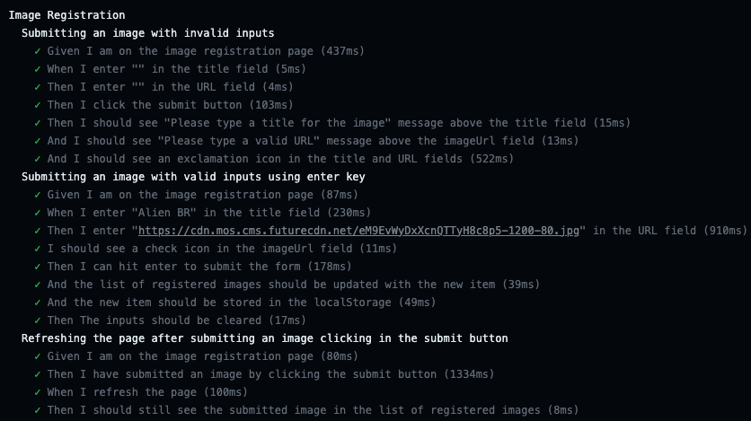

# Example of how to run e2e and unit tests on serverless apps using LocalStack and Jest

Hi this is the repo containing code examples and challenges of my video on [Cypress for begginers - Creating e2e tests on frontend apps](https://bit.ly/mini-curso-cypress). 

**First leave your star in the repo 🌟**

There are two folders. In the [./in-class-project](./in-class-project) you''ll find the examples shown in class and challenges and on [./complete-project](./complete-project) the final project containing the answers of the challenge

The CI output of the solved challenges will look like below:

